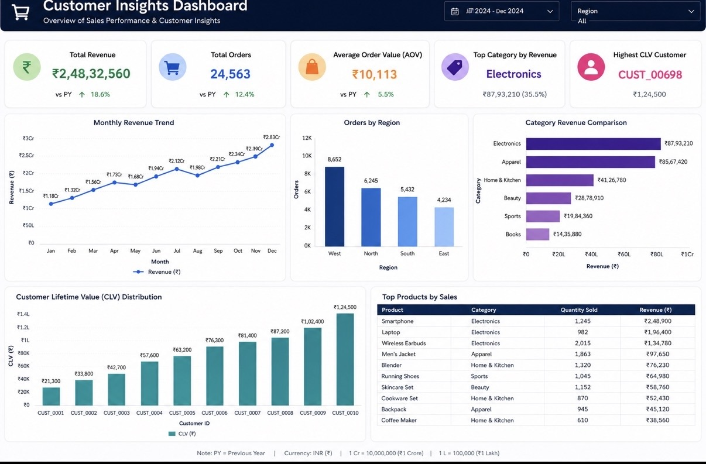

## Dashboard Preview

# Customer Insights Dashboard

This project simulates a real-world BI workflow using SQL, Python, and Tableau/Power BI.

## Features
- ETL pipeline with Python and SQLite
- SQL queries for revenue trends, top categories, and CLV
- Dataset of realistic e-commerce transactions
- Dashboard-ready outputs for visualization

## Tech Stack
- Python (Pandas, SQLite)
- SQL
- Tableau / Power BI

## How to Run
1. Save `ecommerce_sales.csv` in the project folder.
2. Run `etl_pipeline.py` to load data into SQLite.
3. Execute queries in `analytics_queries.sql` for insights.
4. Connect the SQLite DB to Tableau/Power BI for dashboards.
